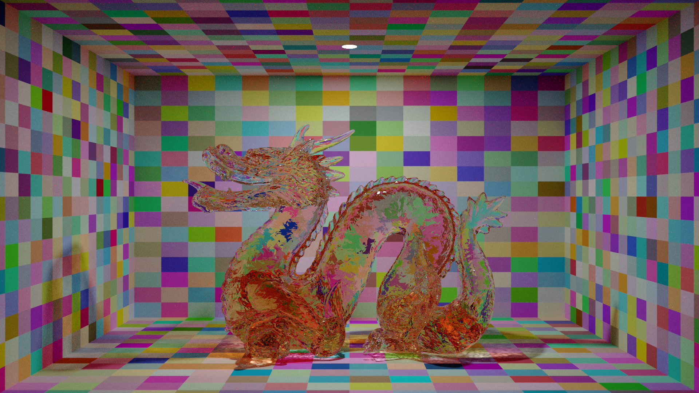
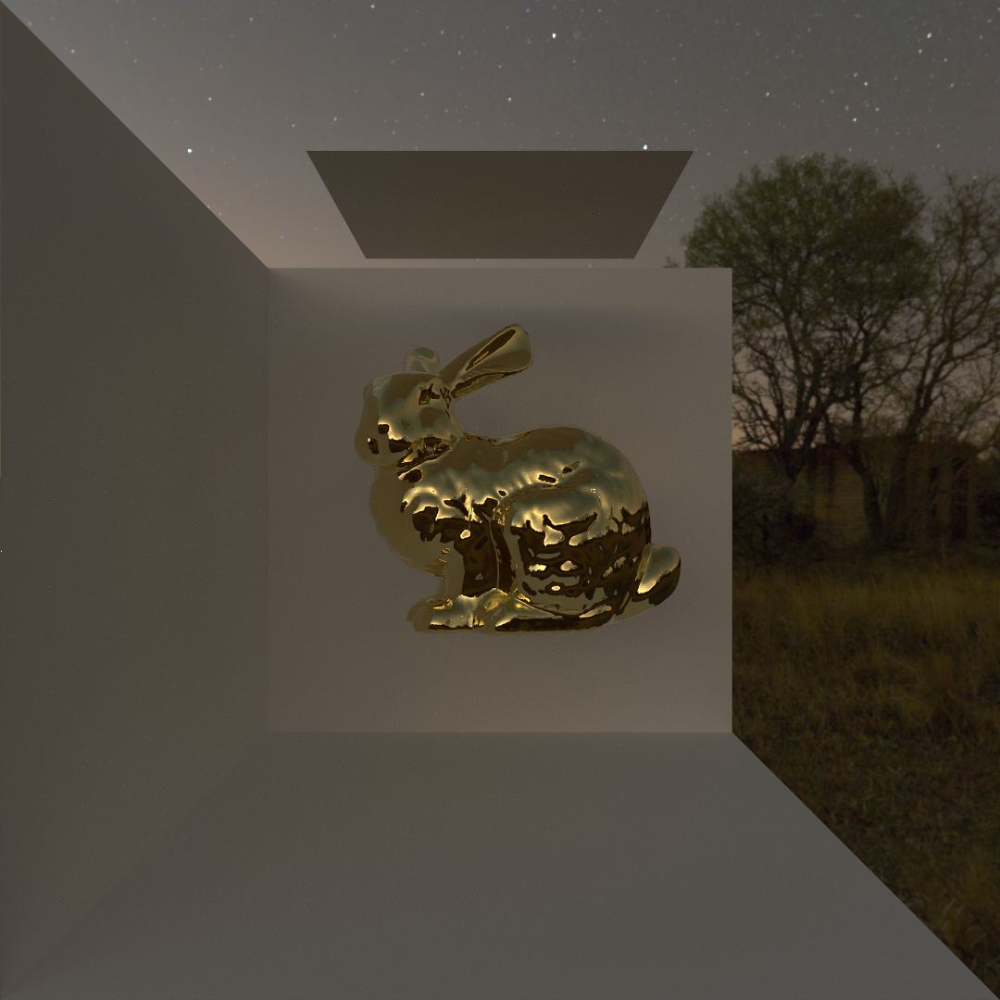
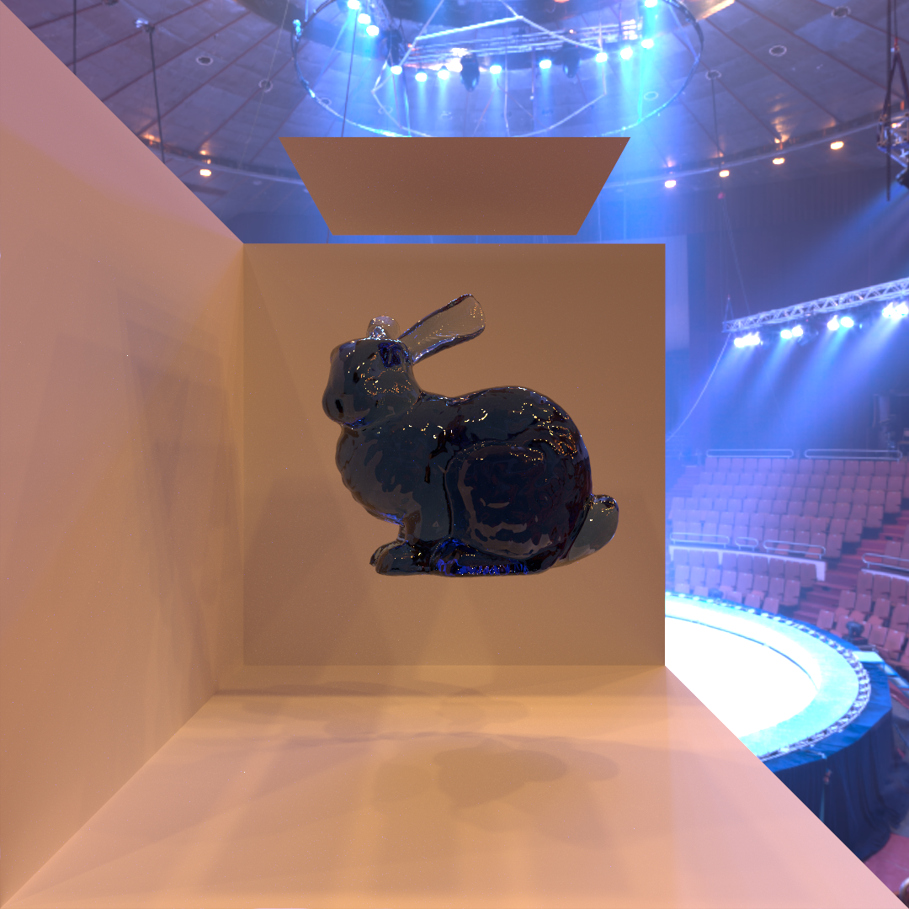

# vcm-impl; An implementation of Vertex Connection and Merging.
## Disclaimer
### Messy codebase
This work used to be my hobby project so the codebase is unstructured, and had been left untouched since around 2017. I only organized the files and added this document to make them more presentable.
### Missing sample files
Sample scene and render configuration files are missing so you can't feed them to the built program and render an image since I've lost the accompanying work that prepared them.
## Introduction
This work is an implementation of the light transport algorithm proposed in the paper *Light transport simulation with vertex connection and merging*.

You can read the paper from [here](https://iliyan.com/publications/VertexMerging).
## Build
do the following.
```bash
./build.sh
```
## Usage
*CURRENTLY NOT POSSIBLE DUE TO NECESSARY SAMPLE FILES MISSING.*

feed scene and render configuration files like so;
```bash
./vcm <output image file path> <render configuration file path> <scene file path #1>...<scene file path #N>
```
and it should produce the rendered image file in PFM format.
## Gallery
Here are some images rendered with this program.


And some images rendered with similar programs of mine.


## Preliminaries
For those who are unfamiliar with rendering, light transport theory or monte carlo ray tracing, see below.
### What is rendering?
In computer graphics, rendering is a process by which a computer program is fed geometric and material parameters desined by the artist to produce images. Images rendered using monte carlo ray tracing techniques in particular are photorealistic owing to underlying physically feasible mathematical models and sophisticated algorithms.

You can watch [this video](https://www.youtube.com/watch?v=frLwRLS_ZR0) for easier understanding of rendering and ray tracing.
### What is light tranport theory?
Light transport theory is a field of study to solve light transport problems under mathematical frameworks and through computer simulations to render photorealistic images.
### What is monte carlo ray tracing?
Monte carlo ray tracing is a technique that applies monte carlo integration to light transport problems to solve them.
### Where can I learn about these stuff?
The fundamentals of light transport theory is described by *Eric Veach* in his thesis *Robust Monte Carlo Methods for Light Transport Simulation*.

You can read his thesis from [here](https://graphics.stanford.edu/papers/veach_thesis/).

For more thorough and friendly reading material that also covers implementational concerns, you can read the book *Physically Based Rendering:From Theory To Implementation*.

You can read the book from [here](https://pbr-book.org/4ed/contents).
## Theory
The fundamentals of light transport theory and monte carlo ray tracing is briefly described here. Built on top of that, the algorithm Vertex Connection and Merging is also described briefly.
### The Physical Quantities
The central physical quantity we deal with in light transport theory is an radiometric quantity borrowed from the frameworks of radiative transfer in thermodynamics that represents positional and directional power density: Radiance, which is a quantity represented as $\frac{d^2\Phi(r,\omega)}{dA(r)d\sigma^\perp(r, \omega)}$; radiant flux per area per projected solid angle. conventionally denoted as $L$.

And the quantity that represents response of the hypothetical camera sensor: Importance, which is a quantity represented as $\frac{dS(r,\omega)}{d\Phi(r,\omega)}$; sensor response per radiant flux. conventionally denoted as $W$.
### The Light Transport Equations
Light transport, light emitted from light sources, scattering on surfaces, finally arriving to the hypothetical camera sensor, is mathematically formulated as below.
$$L_o(r,\omega_o)=L_e(r,\omega_o)+\int_\Omega f_s(r,\omega_o,\omega_i)L_i(r,\omega_i)d\sigma^\perp(r,\omega_i)$$

$$I=\int_\mathcal{M} \int_\Omega W_e(r,\omega_i)L_i(r,\omega_i)d\sigma^\perp(r,\omega_i)dA(r)$$

$$L_i(r,\omega)=L_o(T(r,-\omega),\omega)$$

The quantities are:
- $L_e$, $L_i$ and $L_o$; the emitted, incident and exitant radiance, respectively.
- $W_e$; the emitted importance.
- $f_s$; the bidirectional reflectance distribution function (BRDF) represented as $\frac{dL_o(r,\omega_o)}{L_i(r,\omega_i)d\sigma^\perp(\omega_i)}$ that models scattering of light.

And the integration domains are:
- $\Omega$; unit sphere representing incident directions.
- $\mathcal{M}$; surfaces in space.

$T$ is the ray-casting function that gives the nearest point of intersection on surfaces.

This is our initial formulation and our interest is to solve for $I$. In practice, this represents the pixel value of the rendered image.

To apply sophisticated techniques, it is necessary to express the equations in an alternative form.

We first introduce change of variable by relation between projected solid angle and area measure of two vertices $\frac{d\sigma^\perp(r,\widehat{r-r'})}{dA(r')}=\frac{|N(r)\cdot \widehat{r-r'}||N(r')\cdot \widehat{r-r'}|}{||r-r'||^2}$, where $N(r)$ is the normal to the surface. We also introduce a binary indicator between two vertices $V(r,r')$ that represents geometric occulusion. Combining them together we define a geometric coefficient $G(r,r')=V(r,r')\frac{|N(r)\cdot \widehat{r-r'}||N(r')\cdot \widehat{r-r'}|}{||r-r'||^2}$.

Then express the rendering equation as the three vertex form.
$$L_o(r',\widehat{r''-r'})=L_e(r',\widehat{r''-r'})+\int_\mathcal{M}f_s(r',\widehat{r''-r'},\widehat{r'-r})L_o(r,\widehat{r'-r})G(r,r')dA(r)$$

It follows that the our interest $I$ can be expanded into infinite sum of chains of integrals, the vertex form.
$I=\sum_{1\leq k}\int_{\mathcal{M}^{k+1}}L_e(r_0,\widehat{r_1-r_0})G(r_0,r_1)\prod_{1\leq i\lt k}f_s(r_i,\widehat{r_{i+1}-r_i},\widehat{r_i-r_{i-1}})G(r_i,r_{i+1})W_e(r_k,\widehat{r_k-r_{k-1}})dA(r_0)\ldots dA(r_k)$

Motivation of this form is so that we can apply multiple importance sampling (MIS) that follows.

We can further simplify it by introducing the path space; $\Psi=\bigcup_{1\leq k}\Psi_k$ with $\Psi_k=\mathcal{M}^{k+1}$, the area-product measure; $\mu(D)=\int_D dA(r_0)\cdots dA(r_k)$ and the path measurement function;
$$f(\overline{r})=L_e(r_0,\widehat{r_1-r_0})G(r_0,r_1)\prod_{1\leq i\lt k}f_s(r_i,\widehat{r_{i+1}-r_i},\widehat{r_i-r_{i-1}})G(r_i,r_{i+1})W_e(r_k,\widehat{r_k-r_{k-1}})$$

Then we have a single integration over the path space domain;
$$I=\int_\Psi f(\overline{r})d\mu(\overline{r})$$

### Estimator
In practical scene configurations, analytically solving the light transport equation is impossible. quadrature method is also impractical because of high dimensionality of integration domain.

We instead solve it using monte carlo estimator, which can approximate our interest $I$ by drawing independent samples from the path space according to some distribution and averaging the estimates. The samples are generated using psuedorandom number generator (PRNG) in practice.
$$\hat{I}=\frac{1}{N}\sum_{i\leq N}\frac{f(\overline{r}_i)}{p(\overline{r}_i)}$$

Where $N$ is the number of samples drawn and $p$ is a probability density function in the path space. With a condition that $p$ is non-zero whenever $f$ is non-zero, and the independent samples are drawn from that distribution, the estimator is unbiased;
$$E[\hat{I}]=E[\frac{1}{N}\sum_{i\leq N}\frac{f(\overline{r}_i)}{p(\overline{r}_i)}]$$

$$=\frac{1}{N}\sum_{i\leq N}E[\frac{f(\overline{r}_i)}{p(\overline{r}_i)}]$$

$$=\frac{1}{N}\sum_{i\leq N}\int_\Psi \frac{f(\overline{r}_i)}{p(\overline{r}_i)}p(\overline{r}_i)d\mu(\overline{r}_i)$$

$$=\frac{1}{N}\sum_{i\leq N}\int_\Psi f(\overline{r}_i)d\mu(\overline{r}_i)$$

$$=\frac{1}{N}\sum_{i\leq N}I=I$$

### Bidirectional Path Tracing
Ultimate goal of monte carlo integration is variance reduction of the estimator, which is achieved when the distribution of samples is proportional to the integrand (proof can be difficult). Naive sampling strategy is to random walk the surfaces starting from the hypothetical camera sensor, sample an incident direction at each vertex using inversion method (importance sampling), or do the similar starting from the light sources (justification of this strategy requires formulation of importance transport, which we will skip).

Either approach becomes impractical when the scene is dominated by indirect illumination.

We can combine them to design a good estimator by connecting the vertices between camera and light paths, and taking the weighted average of the estimators from the connected paths (multiple importance sampling).

$$\hat{I}=\sum_{i\leq n}\frac{1}{N_i}\sum_{j\leq N_i}w_i(\overline{r}_{i,j})\frac{f(\overline{r}_{i,j})}{p(\overline{r}_{i,j})}$$

*GONNA SKIP THE MATHS FROM HERE ON BECAUSE GITHUB STARTED GLITCHING AND WON'T RENDER THE EXPRESSIONS LOL!*

Typical design of the weight is the balance or power heuristics.

This method is unbiased and can handle complex indirect lighting in most scenarios, but still suffers with a type of specular path; the notorious specular-diffuse-specular (SDS) path, which is practically, and sometimes theoretically impossible to integrate because of delta functions appearing in the integrand (e,g. caustics formed underwater seen through the surface, caustics seen through a mirror, both of which are not uncommon scenario).
### Vertex Connection and Merging
This method combines bidirectional path tracing (vertex connection) and photon mapping (merging) via multiple importance sampling. method of photon mapping is a convolution by a kernel with an extra vertex at the end of a path. The convolution kernel is designed to have a parameter whose aymptotic distribution is a delta function, so that the convolution approximates the true integral.

It can handle SDS paths by loosely speaking, blurring energy contribution over the integration domain. So the resulting image will appear blurry at lower nuber of samples and is characterized by low frequency noise, which is perceptually less noticeable than high frequency noise seen with vertex connection methods.

Theoretical generality of this method is great, but it leaves a practical concern. For small radii of kernel, one needs to cache and gather millions of vertex points, which is a memory-intensive process, in contrast with the vertex connection methods which has a constant space complexity with respect to the simulation size.

## Implementation
### Overview
The implementation first reads the scene and render configuration files. Then it constructs the BVH structure and does the precalculations for light samplers. Then it samples light paths by traversing the scene and stores them in the vertex cache. This process is parallelized over multiple threads. Then it constructs the kd-tree for the vertex cache. Then it connects and merges the vertices in the cache to calculate the weights and accumulate the weighted estimates into image pixels, while testing for geometric occulusion for vertex connection and gathering vertices for vertex merging. This process is also parallelized.
### Program Components
I briefly describe program components worthy of note here.

- For the PRNG, I employed one from the xorshift family, although PCG family seems to be the standard choice for monte carlo ray tracing.

- For accelerating scene traversal, I employed binary bounding volume hierarchy (BVH) and surface area heuristics (SAH) with full sweeping to build the acceleration structure.

- For accelerating gathering process, I employed kd-tree, but uniform grid with locality-sensitive hash (hash grid) is a better choice, as construction and query time complexity is much lower than kd-tree with respect to the number of vertices in the cache. The vertex cache is constructed for all threads instead of one cache per thread, so both construction and gathering is slow.

### Code Sections
I briefly describe code sections worthy of note to help understand the codebase here.

- L#236-281: PRNG (xoroshiro128+).
- L#283-376: Basic vector maths and reflection/refraction vector transforms.
- L#382-484: Intersection tests and statistical routines of geometric primitives.
- L#517-531: Dielectric and conductive fresnel reflection coefficient calculations.
- L#533-575: Utilities for sampling BRDF by inversion method.
- L#577-783: Emission distribution functions (I made it up) and BRDF evaluation and sampling.
- L#797-834: Precalculation of discrete distribution of lights in the scene.
- L#835-1017: BVH construction by SAH with full sweep and traversal.
- L#1158-1185: Initial ray sampling for camera and light.
- L#1227-1294: Scene traversal, path generation and saving vertex infromation.
- L#1295-1337: Native path tracing.
- L#1338-1374: kd-tree construction.
- L#1375-1565: Vertex merging (gathering) process; weight calculations and estimate accumulations.
- L#1566-1940: Vertex connection process; weight calculations and estimate accumulations.
- L#1941-2081: Vertex connection and merging.
- L#2082-2376: Vertex connection process (Another vertex connection process, because weight calculations are different (less) for bidirectional path tracing); weight calculations and estimate accumulations.
- L#2377-2426: Bidirectional path tracing.
## Reference
- [*Light transport simulation with vertex connection and merging*](https://iliyan.com/publications/VertexMerging)
- [*Disney's Practical Guide to Path Tracing*](https://www.youtube.com/watch?v=frLwRLS_ZR0)
- [*Robust Monte Carlo Methods for Light Transport Simulation*](https://graphics.stanford.edu/papers/veach_thesis/)
- [*Physically Based Rendering:From Theory To Implementation*](https://pbr-book.org/4ed/contents)
- [*xoshiro / xoroshiro generators and the PRNG shootout*](https://prng.di.unimi.it/)
- [*On fast Construction of SAH-based Bounding Volume Hierarchies*](https://www.sci.utah.edu/~wald/Publications/2007/ParallelBVHBuild/fastbuild.pdf)
- [*Fast Minimum Storage Ray Triangle Intersection*](https://cadxfem.org/inf/Fast%20MinimumStorage%20RayTriangle%20Intersection.pdf)
- [*The Stanford 3D Scanning Repository*](https://graphics.stanford.edu/data/3Dscanrep/)
